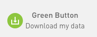

# PG&E Cost and Usage Summaries for Gas and Electricity

This notebook creates a summary report of your electrical and natural gas billing data based on the format provided by PG&E, the California utility company. You should be able to easily adapt it to similar data in other formats.  I was frustrated by the limited information provided by PG&E to help me understand my energy consumption, so I wrote this for my own purposes. Use at your own risk.

You can use this notebook via Binder by uploading your PG&E data files directly into the binder - they will get deleted once the instance is closed (just don't provide the actual URL of the running instance to anyone if you don't want them to see your personal data).  In JupyterLab, you can upload your CSV files via drag-and-drop into the left-side file manager panel.

If you run this notebook with your own data files, you should get a report with information like the one below (real data, values obscured for privacy reasons):

It will also include automatically annual average data (averaging all months across years - only first figure shown here):

## Usage

On PG&E website, go to your "Account Dashboard", then click on "Energy Use Details", which should take you to a page with a usage histogram, and a Green Button to download your data:

When you click on it, you should get this view:

from which you can request bill totals in CSV format for the period you are interested in (this notebook can process your entire history if you select "Export all bill totals"). You should get a Zip file called `BillingData.zip` that contains two files, named `pge_electric_billing_.....csv` and `pge_gas_billing....csv`, where the dots contain your account number and date ranges.

Open the Zip file and rename those two files to `pge_electric.csv` and `pge_gas.csv`. Put them next to the notebook in this folder, and you can then run the entire notebook as-is. You can obviously leave their names unchanged, but then you'll need to edit the notebook with your chosen filenames.

## License

BSD 3-Clause License

Copyright (c) 2022 Fernando Pérez

Redistribution and use in source and binary forms, with or without modification, are permitted provided that the following conditions are met:

1. Redistributions of source code must retain the above copyright notice, this list of conditions and the following disclaimer.

2. Redistributions in binary form must reproduce the above copyright notice, this list of conditions and the following disclaimer in the documentation and/or other materials provided with the distribution.

3. Neither the name of the copyright holder nor the names of its contributors may be used to endorse or promote products derived from this software without specific prior written permission.

THIS SOFTWARE IS PROVIDED BY THE COPYRIGHT HOLDERS AND CONTRIBUTORS "AS IS" AND ANY EXPRESS OR IMPLIED WARRANTIES, INCLUDING, BUT NOT LIMITED TO, THE IMPLIED WARRANTIES OF MERCHANTABILITY AND FITNESS FOR A PARTICULAR PURPOSE ARE DISCLAIMED. IN NO EVENT SHALL THE COPYRIGHT HOLDER OR CONTRIBUTORS BE LIABLE FOR ANY DIRECT, INDIRECT, INCIDENTAL, SPECIAL, EXEMPLARY, OR CONSEQUENTIAL DAMAGES (INCLUDING, BUT NOT LIMITED TO, PROCUREMENT OF SUBSTITUTE GOODS OR SERVICES; LOSS OF USE, DATA, OR PROFITS; OR BUSINESS INTERRUPTION) HOWEVER CAUSED AND ON ANY THEORY OF LIABILITY, WHETHER IN CONTRACT, STRICT LIABILITY, OR TORT (INCLUDING NEGLIGENCE OR OTHERWISE) ARISING IN ANY WAY OUT OF THE USE OF THIS SOFTWARE, EVEN IF ADVISED OF THE POSSIBILITY OF SUCH DAMAGE.